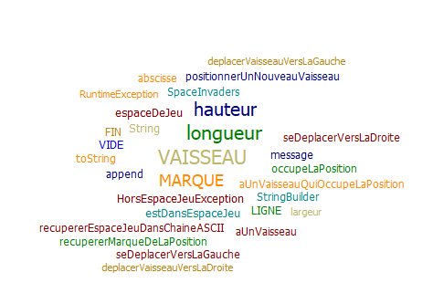

# Space Invaders

>Bienvenue sur mon repertoire de TDD sur le projet Space Invaders. Vous trouverez les fichiers essentiels pour la compilation et l'exécution, puis à la fin du projet un fichier release en .jar

## Semaine n°1 : du 29/03/2021 au 03/04/2021

> Mise en place du projet Maven avec la création du projet vide + début de la story n°1 : créer un espace de jeu

> Critères d'acceptance : 
> - L'espace de jeu doit avoir une dimension donnée 
> - L'espace de jeu doit être vide lors de sa création

> Respect des critères : 
> Le code respecte les critères donnés, La story n°1 est terminée

## Semaine n°2 : du 05/04/2021 au 10/04/2021

> Implémentation de la fonctionnalité de déplacement du vaisseau dans l'espace de jeu

> Critères d'acceptance :
> - Le vaisseau doit pouvoir se déplacer sur la gauche ou sur la droite
> - Le vaisseau ne doit pas pouvoir dépasser les liites de l'espace de jeu

> Problèmes rencontrés : :unamused:
> - Le vaisseau ne se déplace pas sur le bon axe
> - Le vaisseau se déplace quand même alors qu'il est à la limite de l'espace de jeu

## Nuage de mots

